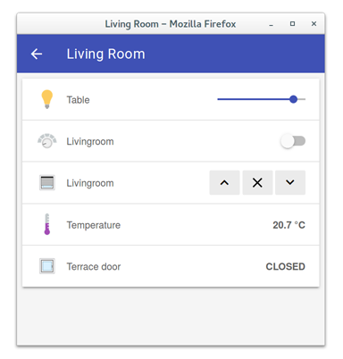



# OpenHAB 2 UIs

OpenHAB 2 offers different UIs in its standard configuration: the _Paper UI_, the _Basic UI_ and the _Classic UI_.

# The Paper UI

The Paper UI is a new interface that helps setting up and configuring your openHAB instance.
It does not (yet) cover all aspects, so you still need to resort to textual configuration files, but it already offers the following:

- Add-on management: Easily install or uninstall openHAB add-ons

- Thing discovery: See devices and services found on your network and add them to your setup.

- Linking items to channels: Instead of adding a binding configuration to your item file, you can directly link Thing channels to your items.

Note that you still need to define your items, sitemaps, persistence configurations and rules in the according configuration files (as done in openHAB 1). Such functionality will be added bit by bit to the Paper UI only.

All these aspects are explained in the rest of this manual/

Here you can find a small screencast about the Paper UI:

# The Basic UI

The Basic UI is a web interface based on Material Design Lite from Google. This interface is used to present the different sitemaps.

The UIs features are:

* Responsive layout suitable for various screen sizes
* AJAX navigation
* Live update1

1: as for now, only control states and icons are updated. Visibility changes require a page reload.

# The Classic UI

The Classic UI offers the same services that the Basic UI but with a different look and feel, close to an old iOS one.

